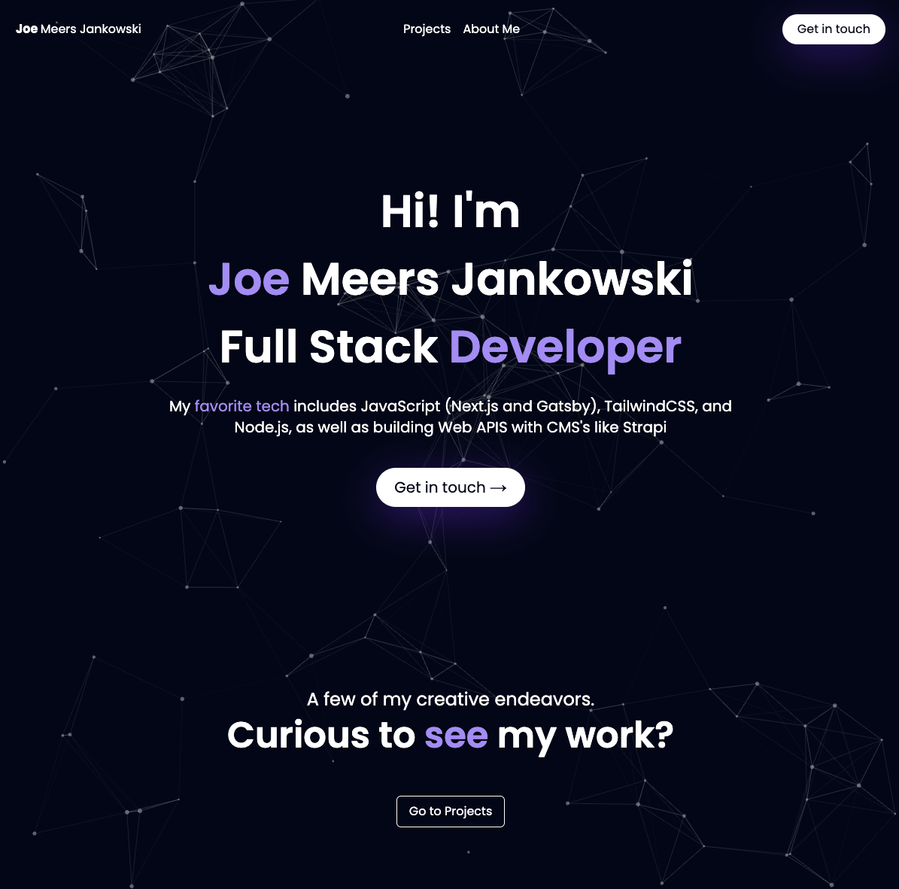

# Personal Website

This repository contains the source code for Joe Meers Jankowski's personal website, built using Next.js and fetching content from a WordPress instance hosted on WPEngine.

## Preview

[joemeersjankowski.com](https://joemeersjankowski.com)

## Features

- **Next.js**: The React framework for building efficient and interactive user interfaces.
- **TailwindCSS**: Utility-first CSS framework
- **GraphQL**: GraphQL is a query language for your API, and a server-side runtime for executing queries using a type system you define for your data

- **WordPress Backend**: Using WordPress as a headless CMS to manage project lists
